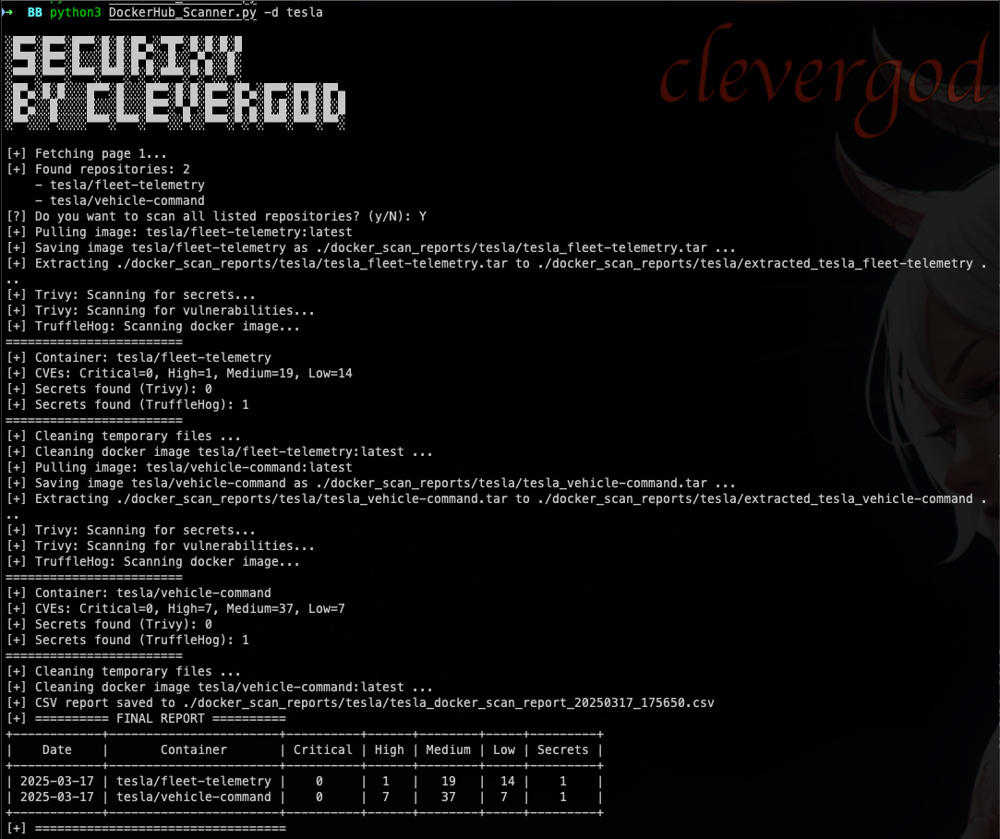

# COMPANY DockerHub Scanner

🐳 COMPANY DockerHub Scanner  
Automated scanner for DockerHub repositories. It pulls, extracts, scans Docker images for vulnerabilities, secrets, and sensitive data.  
Results are presented in the terminal and exported as CSV files.

---

## ✨ Features

- ✅ Pulls Docker images from DockerHub (`namespace/repository`)
- ✅ Extracts image layers and scans for JAR/WAR files
- ✅ Decompiles `.class` files (optional feature for JAR/WAR analysis)
- ✅ Scans for:
  - Vulnerabilities (via **Trivy**)
  - Secrets and passwords (via **Trivy** and **TruffleHog**)
- ✅ Scans a single image (`-i`) or all repositories in a namespace (`-d`)
- ✅ Generates clear terminal output and final reports
- ✅ Exports CSV reports to `docker_scan_reports/<domain>/`
- ✅ Optional cleanup of extracted/tar files (default)
- ✅ Verbose/debug mode available (`-v`)
- ✅ Telegram notification support (commented, but ready)


---

## ⚡️ Installation

### Prerequisites

- Python 3.x
- Docker installed and running
- `trivy` - [Install Trivy](https://aquasecurity.github.io/trivy/)
- `trufflehog` - [Install TruffleHog](https://github.com/trufflesecurity/trufflehog)

Install required Python libs:
```bash
pip install prettytable
```

---

## 🚀 Usage

### Scan all repositories in a DockerHub namespace:
```bash
python3 DockerHub_Scanner.py -d tesla
```

Example:
```
[+] Fetching page 1...
[+] Found repositories: 2
    - tesla/fleet-telemetry
    - tesla/vehicle-command

[?] Do you want to scan all listed repositories? (y/N): y
```

### Scan a specific DockerHub image:
```bash
python3 DockerHub_Scanner.py -i tesla/fleet-telemetry
```

---

## 🔧 Options

| Option      | Description                                              |
|-------------|----------------------------------------------------------|
| `-d`        | DockerHub namespace (e.g., `tesla`)                     |
| `-i`        | Specific image to scan (e.g., `tesla/fleet-telemetry`)  |
| `-t`        | Image tag (default: `latest`)                           |
| `-v`        | Verbose / Debug mode (prints all commands and logs)     |
| `--keep`    | Keep extracted files and tarballs (no cleanup)          |
| `-h`        | Show help                                               |

---

## 📂 Reports & Outputs

- All results are saved in `docker_scan_reports/<domain>/`
- Per repository reports include:
  - Vulnerabilities JSON report
  - Secrets JSON reports (Trivy and TruffleHog)
- Final consolidated CSV report for the scanned domain

---

## 🛡️ Legal & Author

Author: [clevergod](https://www.clevergod.net)  
Telegram Channel: [@securixy_kz](https://t.me/securixy_kz)  

**Disclaimer:** This tool is for educational and research purposes only. The author assumes no responsibility for any misuse.
